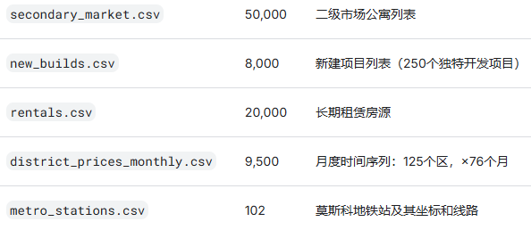
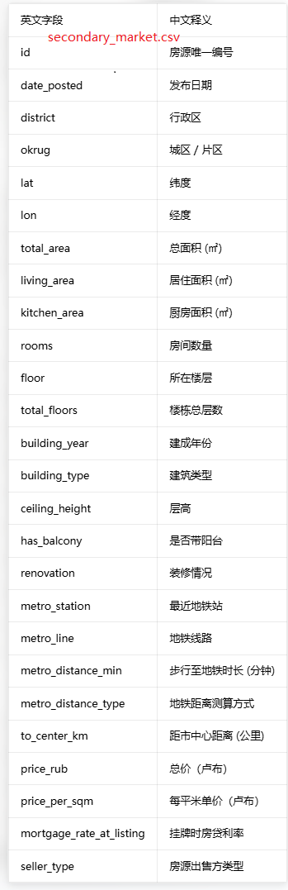
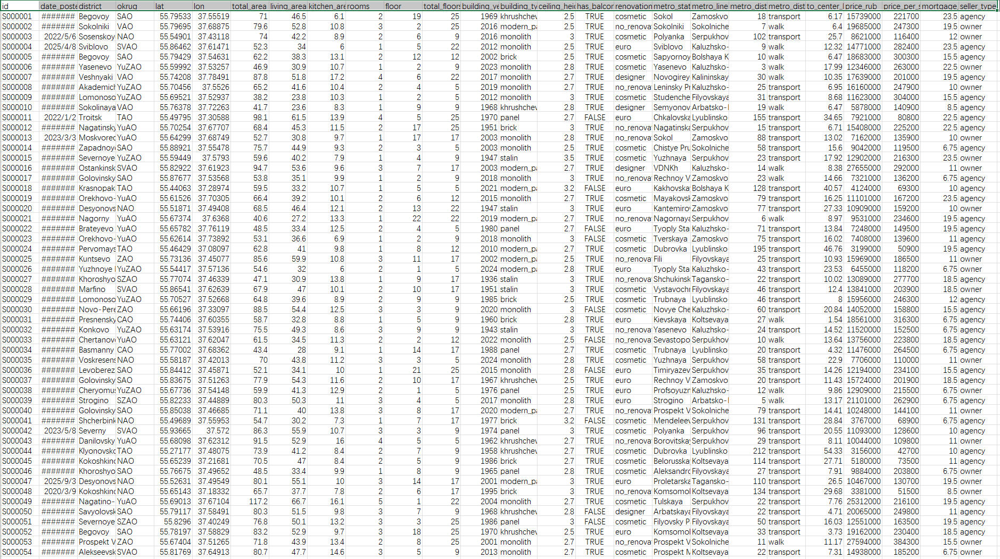
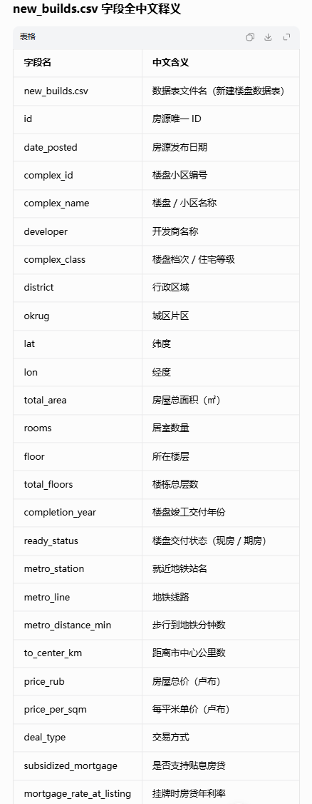
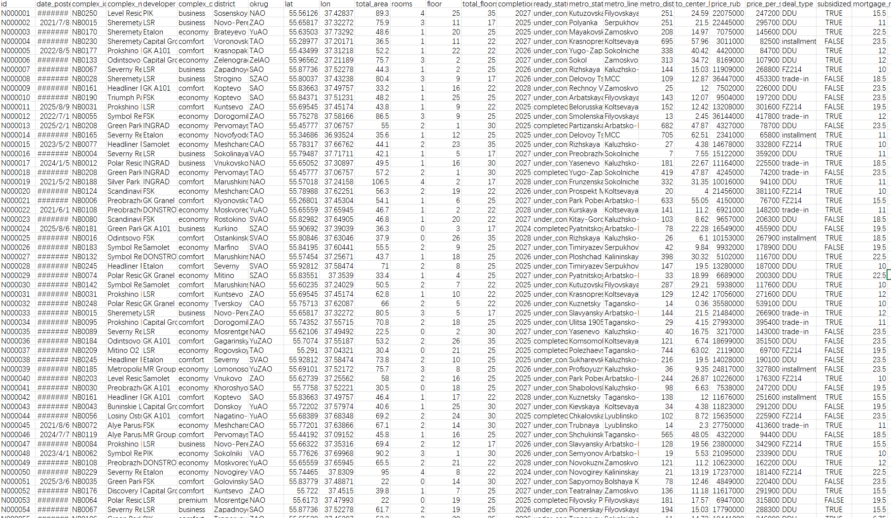

## Body

Moscow Real Estate: Sales and Rentals (2020–2026)

125 districts with 78,000+ listings, real-time coordinates, subway distances

A comprehensive dataset covering three segments of the Moscow real estate market—secondary sales, new construction, and rentals—covering all 125 administrative districts in Moscow.

The data covers from January 2020 to April 2026, encompassing major macroeconomic events shaping the market: the rebound in subsidized mortgage loans during the COVID-19 period, the impact of the 2022 shock, the end of universal subsidized mortgage projects in July 2024, and the high-interest environment from 2025 to 2026.

For specific statistical fields, please refer to the product images.

## Images

item_1052882996093

Here is a pay link on Stripe ( https://buy.stripe.com/3cs8yP7sY87d0vu9AB ). Please contact me lonlonago@foxmail.com after funding $89, and I will send you a complete data files , thank you!

